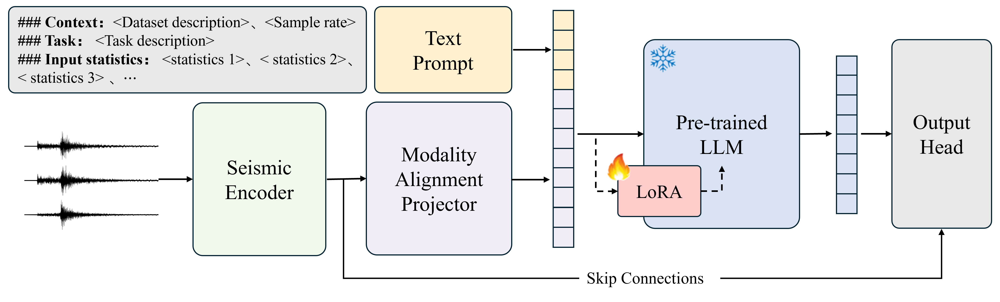

# SeisLLM

- [SeisLLM Architecture](#seisllm-architecture)
- [Usage](#usage)
  - [Training](#training)
  - [Testing](#testing)
- [Citation](#citation)
- [Acknowledgement](#acknowledgement)

## SeisLLM Architecture

<p align="center">
  
</p>

## Usage

- **Model Configuration**  
  The configuration of model losses, labels, and evaluation targets is defined in `config.py`, with more detailed explanations provided in that file.

- **Supported Tasks**  
  The repository supports the following tasks:
  - `SeisLLM_emg` for magnitude estimation
  - `SeisLLM_dis` for epicentral distance estimation
  - `SeisLLM_dpk` for phase picking

- **Prompt File Note**  
  The default configuration uses the `diting_light` setting and reads the prompt file from:  
  `data/prompt_bank/diting_light.txt`

### Training

```Shell
torchrun \
  --nnodes 1 \
  --nproc_per_node 1 \
  main.py \
    --deepspeed \
    --deepspeed_config ds_config.json \
    --seed 3407 \
    --mode "train" \
    --model-name "SeisLLM_emg" \
    --llm "GPT2" \
    --LLM_layer_num 6 \
    --d_model 768 \
    --d_patch 256 \
    --log-base "./logs" \
    --log-step 300 \
    --data "./datasets/DiTing330km" \
    --dataset-name "diting_light" \
    --data-split true \
    --train-size 0.8 \
    --val-size 0.1 \
    --workers 6 \
    --in-samples 8192 \
    --batch-size 192 \
    --augmentation false \
    --epochs 200 \
    --patience 30 
```

There are also many other custom arguments. See `main.py` for more details.

### Testing

```Shell
torchrun \
  --nnodes 1 \
  --nproc_per_node 1 \
  main.py \
    --deepspeed \
    --deepspeed_config ds_config.json \
    --seed 3407 \
    --mode "test" \
    --model-name "SeisLLM_emg" \
    --checkpoint "/path/to/your/checkpoint" \
    --use-flash-attn true \
    --llm "GPT2" \
    --LLM_layer_num 6 \
    --d_model 768 \
    --d_patch 256 \
    --log-base "./logs" \
    --log-step 300 \
    --data "./datasets/DiTing330km" \
    --dataset-name "diting_light" \
    --data-split true \
    --train-size 0.8 \
    --val-size 0.1 \
    --shuffle true \
    --workers 6 \
    --in-samples 8192 \
    --batch-size 192
```

It should be noted that `train_size` and `val_size` during testing must be consistent with those used during training, and the `seed` should also remain consistent. Otherwise, the test results may be distorted.

## Citation

The baseline models used in this project include:

- **PhaseNet**  
  *Zhu, W., & Beroza, G. C. (2019). PhaseNet: A deep-neural-network-based seismic arrival-time picking method. Geophysical Journal International, 216(1), 261-273.*

- **EQTransformer**  
  *Mousavi, S. M., Ellsworth, W. L., Zhu, W., Chuang, L. Y., & Beroza, G. C. (2020). Earthquake transformer-an attentive deep-learning model for simultaneous earthquake detection and phase picking. Nature Communications, 11(1), 3952.*

- **MagNet**  
  *Mousavi, S. M., & Beroza, G. C. (2020). A machine-learning approach for earthquake magnitude estimation. Geophysical Research Letters, 47(1), e2019GL085976.*

- **SeisT**  
  *Li, S., Yang, X., Cao, A., Wang, C., Liu, Y., Liu, Y., & Niu, Q. (2024). SeisT: A foundational deep learning model for earthquake monitoring tasks. IEEE Transactions on Geoscience and Remote Sensing.*

## Acknowledgement

This project refers to some excellent open-source projects: [PhaseNet](https://github.com/AI4EPS/PhaseNet), [EQTransformer](https://github.com/smousavi05/EQTransformer), [MagNet](https://github.com/smousavi05/MagNet), and [SeisT](https://github.com/senli1073/SeisT).